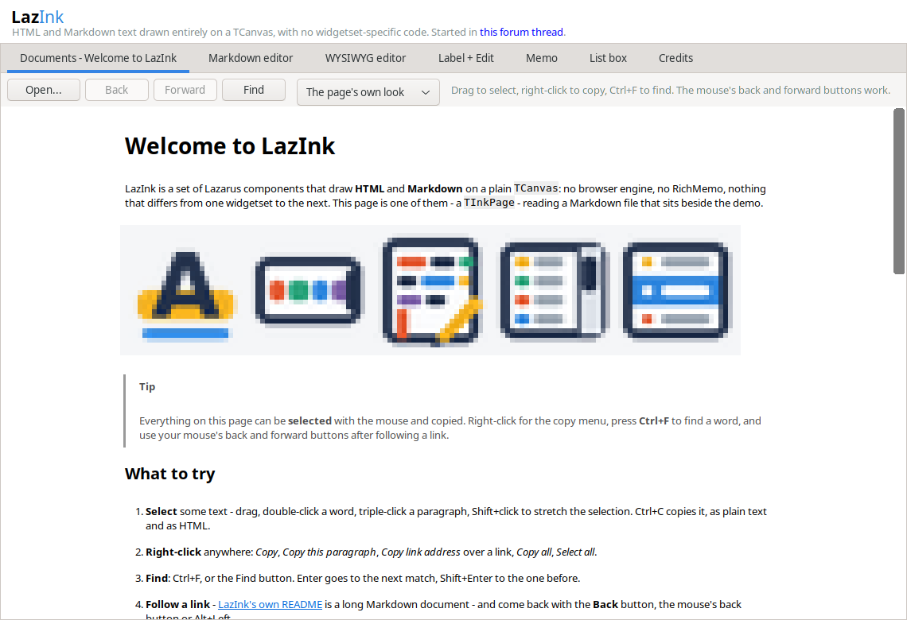
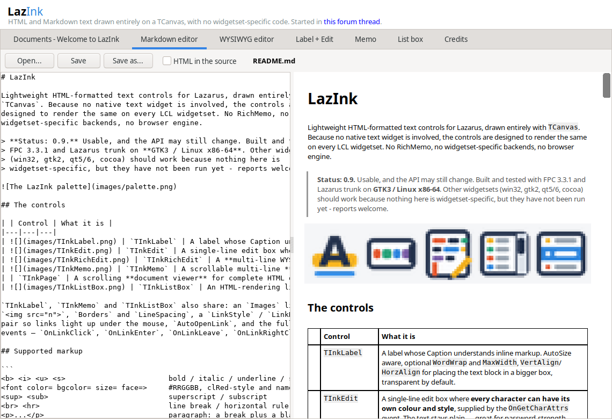
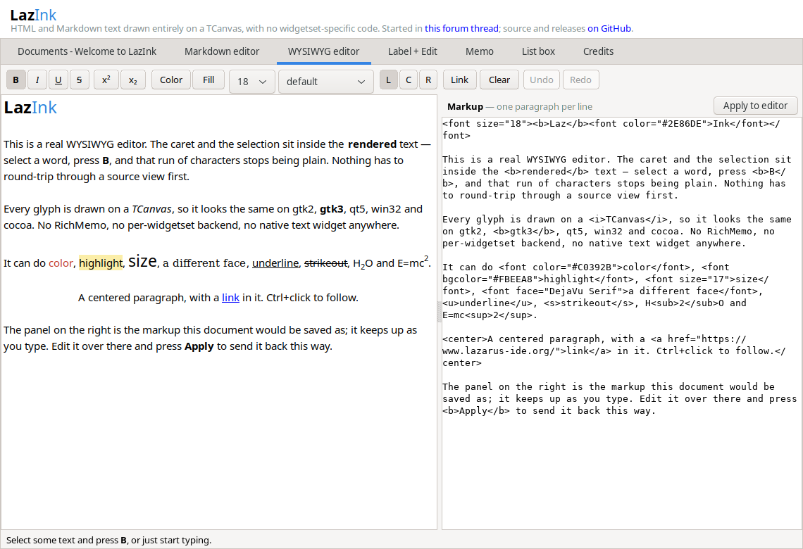
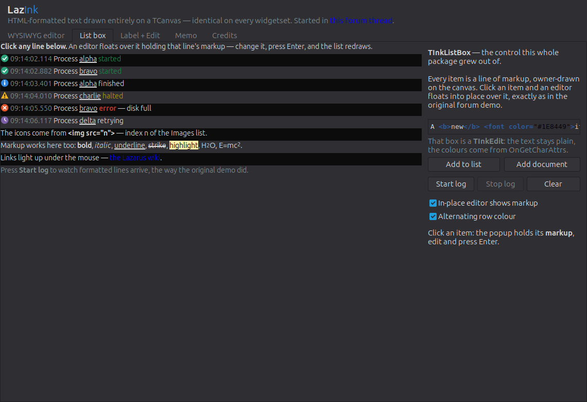

# LazInk

Lightweight HTML-formatted text controls for Lazarus, drawn entirely with
`TCanvas`. Because no native text widget is involved, the controls are
designed to render the same on every LCL widgetset. No RichMemo, no
widgetset-specific backends, no browser engine.

> **Status: 0.9.** Usable, and the API may still change. Built and tested with
> FPC 3.3.1 and Lazarus trunk on **GTK3 / Linux x86-64**. Other widgetsets
> (win32, gtk2, qt5/6, cocoa) should work because nothing here is
> widgetset-specific, but they have not been run yet - reports welcome.


## The controls

| | Control | What it is |
|---|---|---|
|  | `TInkLabel` | A label whose Caption understands inline markup. AutoSize aware, optional `WordWrap` and `MaxWidth`, `VertAlign`/`HorzAlign` for placing the text block in a bigger box, transparent by default. |
|  | `TInkEdit` | A single-line edit box where **every character can have its own color and style**, supplied by the `OnGetCharAttrs` event. The text stays plain — great for password-strength coloring, highlighting digits/symbols, or syntax-coloring markup as it is typed. Full editing: caret, selection, clipboard, MaxLength, ReadOnly, alignment. |
|  | `TInkRichEdit` | A **multi-line WYSIWYG editor**. The caret and the selection sit inside the rendered text: select a word, call `ToggleStyle(fsBold)`, and that run stops being plain. Per-character color, background, size, face, style, super/subscript and links; word wrap; paragraph alignment; undo/redo; a `Markup` property that round-trips to the markup below. |
|  | `TInkMemo` | A scrollable multi-line **viewer** — a log, a transcript, formatted help. Each line of `Lines` is one paragraph of markup, lines can differ in height, optional `WordWrap`; `Append` follows the end when the view is there. Drawn by the same engine as `TInkPage`, so its text is selected and copied the same way. |
| | `TInkPage` | A scrolling **document viewer** for complete HTML or Markdown pages: headings, lists, tables, code and key labels, PNG and animated GIF images, relative links, anchors, Back and Forward, and a small stylesheet reader. See [Complete help pages](#complete-help-pages). |
|  | `TInkListBox` | An HTML-rendering listbox with an in-place editor that floats over the clicked item, holding either its plain text or (with `EditRawHTML`) its markup. Optional `AlternateColor` striping. |

**Editing list items in place:** `TInkListBox.EditMode` says when the
floating editor opens by itself - `emOnSelect` (the default; it opens when
the button is released, so the highlight can first be dragged along the list),
`emOnDblClick`, `emOnTripleClick`, `emOnClickSelected` (a click on the item
already selected, after a moment, the way a file manager renames), or
`emNone`. Whatever the mode, `EditItem(Index)` opens it from code, F2 opens it
on the current item (except with `emNone`), `OnBeforeEdit` can refuse, and
`OnItemEdited` sees the result. `EditRawHTML` decides whether the editor holds
the item's markup or its plain text; `Editing` and `CancelEdit` do what they
say.

### Which one?

Two questions decide it: **who writes the text**, and **what shape it is**.

| You want to show... | Who writes it | Use |
|---|---|---|
| a caption, a status, one formatted sentence | the program | `TInkLabel` |
| one line the user types, colored as they type | the user | `TInkEdit` |
| a growing stream of separate lines - a log, a chat, a history of events | the program, a line at a time | `TInkMemo` |
| a whole document - a help page, release notes, a README - with headings, lists, code, pictures and links to other pages | an author, ahead of time | `TInkPage` |
| a list of things to pick from, and maybe rename in place | the program, and the user edits single items | `TInkListBox` |
| formatted text the user writes, with a caret and bold/italic/color buttons | the user | `TInkRichEdit` |

The ones that are easy to mix up:

* **`TInkMemo` or `TInkPage`?** Both are scrolling, read-only and selectable,
  and share one engine. A memo is made of **lines you add** with `Append` -
  each line is small inline markup, lines never merge into lists or tables,
  there is no stylesheet, and the view follows new lines as they arrive. A
  page is **one document you load** - it is laid out as a whole, with
  headings, nested lists, code blocks, CSS and navigation between pages.
  If you would call `Append`, it is a memo; if you would call
  `LoadFromFile`, it is a page.
* **`TInkMemo` or `TInkRichEdit`?** The memo is what the **program** says;
  the user can read, select and copy it but not change it. The rich editor is
  what the **user** writes: a caret, typing, formatting buttons, undo, and
  markup coming out of `Markup` at the end.
* **`TInkMemo` or `TInkListBox`?** In a list box a line is a **thing**: it is
  selected as a whole, it has an index, it can be edited in place, and the
  program reacts to which one is chosen. In a memo a line is **text**: you
  select words across lines and copy them, and nothing happens when you click
  one, apart from its links.

`TInkLabel`, `TInkMemo` and `TInkListBox` also share: an `Images` list for
``, `Borders` and `LineSpacing`, a `LinkStyle` / `LinkHoverStyle`
pair so links light up under the mouse, `AutoOpenLink`, and the full set of link
events — `OnLinkClick`, `OnLinkEnter`, `OnLinkLeave`, `OnLinkRightClick`.

## Supported markup

```
<b> <i> <u> <s>                        bold / italic / underline / strikeout
<font color= bgcolor= size= face=>     #RRGGBB, clRed-style and named colors
<sup> <sub>                            superscript / subscript
<br> <hr>                              line break / horizontal rule
<p>...</p>                             paragraph: a break plus a blank line
<center> <right> <left>                whole-line alignment
<ind="20">                             indent
<a href="...">text</a>                 links (OnLinkClick, hover styling)
                          entry n of the control's Images list
&amp; &lt; &gt; &quot; &nbsp; &copy; &reg; &trade; &euro;
```

Wherever text wraps — `TInkLabel.WordWrap`, `TInkMemo.WordWrap`,
`TInkRichEdit` — lines break on spaces, after slashes in long paths, and,
because CJK does not separate words with spaces, after any Chinese, Japanese or
Korean character, keeping closing punctuation off the start of a line.

Example:

```pascal
InkLabel1.Caption := 'Status: <b><font color="#00AA00">connected</font></b> to <a href="cfg">server</a>';
InkMemo1.Append('<font color="clGray">12:04</font> <b>tony</b> joined');
```

`TInkEdit` doesn't parse markup — it asks you per character instead:

```pascal
procedure TForm1.InkEdit1GetCharAttrs(Sender: TObject; AIndex: Integer;
  const AChar: string; var AColor: TColor; var AStyle: TFontStyles);
begin
  case AChar[1] of
    '0'..'9': AColor := clGreen;
    'A'..'Z', 'a'..'z': ; // leave default
  else
    AColor := clBlue;   // symbols
  end;
end;
```

`TInkRichEdit` is the other way round again — it owns a document, and markup is
only what it reads from and writes back to:

```pascal
InkRichEdit1.Markup.Text := 'A <b>bold</b> start.';   // one paragraph per line
InkRichEdit1.ToggleStyle(fsBold);                     // acts on the selection
InkRichEdit1.ApplyColor(clRed);
InkRichEdit1.ApplySize(18);
ShowMessage(InkRichEdit1.AsHTML('<br>'));             // feed a TInkLabel or TInkMemo
```

With nothing selected, the `Apply*` calls set what the next typed character will
wear, the way every editor behaves. `SelStyle`, `SelColor`, `SelSize`,
`SelFace`, `SelScript` and `SelAlignment` report what the selection currently
carries, so a toolbar can show the right buttons pressed.

## Complete help pages

`TInkPage` is the native scrolling page viewer for complete HTML help files.
It renders the original Heckers Sketch manual with headings, lists, tables,
code/key labels, screenshots, animated GIFs, relative links, and Back/Forward.
Its small stylesheet reader picks up the site's palette and basic typography;
CSS grid cards become a vertical list. No browser engine is added.

```pascal
InkPage1.LoadFromFile('/path/to/help/index.html');
```

It reads Markdown just as well - a `.md` file is recognized by its name, and
`LoadMarkdown` takes a string. Relative images and links are resolved against
the document. A Markdown document has no stylesheet of its own, so
`StyleSheet` lets the program dress it in its own theme; the page's own rules,
when it has some, win over these:

```pascal
InkPage1.StyleSheet.Text :=
  'body { background: #23262c; color: #b8bcc4 } h2 { color: #4ab3e8 }';
InkPage1.LoadMarkdown(ReleaseNotes);
```

Lists hang their bullets and numbers to the left of the text, so wrapped lines
line up under the first word; nested lists step in, and a task list shows its
boxes where the bullets would be. Code blocks keep their spacing in the fixed
face, on a shaded background, and a long line is cut off at the block's edge
rather than wrapped. Quotes get a bar down their left side.

**Its scrollbar** is drawn by LazInk (`TInkScrollBar`), so it can wear the
page's colors instead of the platform's gray.  It reads the same CSS a
browser does:

```css
html { scrollbar-color: #4ab3e8 #1b1e24; scrollbar-width: thin; }
```

`scrollbar-color` is the thumb, then the track - `#rgb`, `#rrggbb`, a color
name, `rgb()`/`rgba()`, `currentcolor`, or a `var()` holding any of those.
`scrollbar-width` is `auto`, `thin` or `none` (none hides the bar; the page
still scrolls).  Both are read from `html` or `:root`, then `body`.  Without
them, the track is the page background and the thumb sits halfway between
that and the text color, so a dark page gets a dark bar with no CSS at all.
`InkPage1.ScrollBar` reaches it from code.

**Touch screens:** drag the page with a finger (or the left mouse button) to
scroll it; a quick flick leaves it coasting (`FlickScroll`).  A tap that
wobbles a few pixels is still a click, and a drag that ends on a link does not
follow it.  `DragScroll := False` turns dragging off.  `ScrollY` reads where
the page is.

Most platforms hand a finger to a program as mouse events, and there nothing
more is needed. GTK3 does not: the Lazarus GTK3 backend asks for raw touch
events and ignores them, and GDK then stops turning fingers into mouse events.
The `InkTouch` unit hooks those touch events on each control's own window -
`TInkPage` follows the finger itself, and `TInkEdit`, `TInkRichEdit` and the
page's scrollbar take a finger as the left mouse button - so a program does
nothing, and any number of controls on any number of forms can be touched.
`InkHookTouch` and `InkHookTouchAsMouse` are there for your own controls, and
`TInkPage.Touch` takes touches from a source of your own.  Only the first
finger is followed. `TInkLabel` has no window of its own, so on GTK3 a finger
does not reach it. The GTK3 path is tested with GDK touch events made by the
test suite; it has not yet been run on a touch screen.

**Selecting and copying:** the mouse selects text on a page the way it does in
a browser - drag, double-click for a word, triple-click for a paragraph,
Shift+click to extend, dragging past the top or bottom scrolls - across
paragraphs, list items, code and table cells. Ctrl+C copies it as plain text
and as HTML; Ctrl+A selects everything. A finger still scrolls
(`MouseDrag := imdScroll` makes the mouse scroll too, for platforms that
cannot tell a finger from a mouse). The highlight is `SelectionColor`, or a
page's `::selection { background: ... }`. From code: `SelectAll`, `Select`,
`SelectedText`, `SelectedHTML`, `CopyToClipboard`, and the character-level
hit test `PositionAt(X, Y)` with its reverse `PositionPoint`.

**Pictures you can click:** a picture inside a link is the link -
`<a href="shots/x.gif" target="_blank"></a>`. Clicking
it (or any link) fires `OnLinkActivate` first, with a `TInkLinkInfo`: the URL
resolved and as written, the link's `target`, and the picture it wraps; set
`Handled` to deal with it yourself - open a zoom window, say. `ClickedLink`
has the same while `OnLinkClick` runs. Left alone, a link to a picture opens
it as a page of its own, with Back to return. For a window that shows one
picture, `ImageFit := iifWindow` makes it as large as fits (`iifWidth`: as
wide as the page; `iifShrink`, the default: never larger than it is):

```pascal
procedure TForm1.PageLinkActivate(Sender: TObject; const Link: TInkLinkInfo;
  var Handled: Boolean);
begin
  if Link.Image = '' then Exit;           // text links: let the page follow them
  ZoomForm.Page.ImageFit := iifWindow;
  ZoomForm.Page.LoadFromURL(Link.Image);
  ZoomForm.Show;
  Handled := True;
end;
```

Pages given as text (`LoadHTML`, `LoadMarkdown`) are in the Back/Forward
history too; `ClearHistory` forgets it.

**Finding:** Ctrl+F opens a find bar at the top right of the page - it finds
as you type, Enter or F3 goes to the next match and Shift with either to the
one before, Esc closes it. From code: `Find(Text, Options)`, `FindCount`,
`ShowFindBar`, `ScrollIntoView`.

**Back and Forward:** `Back`, `Forward`, `CanGoBack` and `CanGoForward` are
there for buttons, and `OnNavigate` fires after each new document so the
buttons can follow. The mouse's own back and forward buttons work too - on
GTK3, where the Lazarus backend drops them, `InkTouch` brings them back - and
so do Alt+Left, Alt+Right and a keyboard's Back and Forward keys.

**The copy menu:** right-click any display control for **Copy**, **Copy this
paragraph** (or line, or item), **Copy link address** over a link, **Copy
all** and **Select all**. `TInkMemo` selects and copies like the page;
`TInkListBox` copies its selected lines with Ctrl+C, and everything after
Ctrl+A; `TInkLabel` offers its words and links. `CopyMenu := False` turns the menu off, a `PopupMenu` of your own
replaces it, and `OnCopyMenu` lets you add items as it opens:

```pascal
procedure TForm1.PageCopyMenu(Sender: TObject; Menu: TPopupMenu; X, Y: Integer);
var Item: TMenuItem;
begin
  Item := TMenuItem.Create(Menu);
  Item.Caption := 'Search the web';
  Item.OnClick := @SearchSelection;
  Menu.Items.Add(Item);
end;
```

Try the demo's **HTML help pages** tab, or pass an HTML filename on its command
line. Keep the help folder's relative image and stylesheet paths intact.
Remote content can be supplied through `OnResource`; HTTP transport is not
built in. See [the compatibility report](docs/HELP_COMPATIBILITY.md) for the
exact CSS subset, tested site coverage, and remaining limitations.

## Tables and Markdown

`TInkLabel`, `TInkMemo`, `TInkListBox`, and `TInkPage` expose `TextFormat`:
`itfHTML` (the default) or `itfMarkdown`, declared in `InkMarkdown`.
Changing it reinterprets the existing source; it does not translate the source.
`TInkEdit` remains plain text and `TInkRichEdit` remains an HTML-backed inline
WYSIWYG editor. Rich-editor table editing is not implemented.

The shared renderer supports simple `<table>`, `<tr>`, `<th>` and `<td>`
blocks, including multiple tables mixed with text. Columns are sized from their
content and narrowed to the available width, cell text wraps, headers are bold,
and borders use the current font color. Links inside cells retain click and
hover support. List boxes now measure variable-height rows, with `ItemHeight`
as their minimum height.

Markdown is read the way GitHub reads it, for the parts real documents use:
`#` and underlined headings (with GitHub's anchors, so `[see](#some-heading)`
works), paragraphs joined across wrapped lines, hard breaks, bullet and
numbered lists nested by indentation (wrapped continuation lines included),
task lists `- [x]`, fenced code with its language kept
(`class="language-pascal"`), indented code, blockquotes and `> [!NOTE]`
alerts, horizontal rules, pipe tables with their alignment, `*` `_` `**` `__`
and `~~` emphasis, code spans, inline, reference and `<angle>` links, bare
`https://` and `www.` links, images, entities and backslash escapes. HTML
comments are dropped. Other raw HTML is shown as text unless you ask for it
(`MarkdownToHTML(S, [imoRawHTML])`, or `TInkPage.MarkdownRawHTML`) - only do
that for documents you trust.

`MarkdownToHTML` gives real HTML - headings, paragraphs, lists, `<pre>` - and
is what `TInkPage` draws. `MarkdownToInk` flattens the same HTML into the
inline markup `TInkLabel`, `TInkMemo` and `TInkListBox` draw, so every control
reads the same Markdown.

```pascal
uses InkMarkdown;

InkMemo1.TextFormat := itfMarkdown;
InkMemo1.WordWrap := True;
InkMemo1.LoadDocument(
  '# Status' + LineEnding +
  '| Name | State |' + LineEnding +
  '| --- | --- |' + LineEnding +
  '| **Server** | Ready |');
```

Memo `Lines` and list-box `Items` remain independent entries. Use
`TInkMemo.LoadDocument` to replace its contents with one complete multiline
HTML or Markdown entry; splitting a table across entries cannot work. For labels,
assign the complete source to `Caption`. `MarkdownToInk(Source)` is also usable
on its own. `SaveAsHTML` on the viewers converts Markdown entries to HTML;
plain-text export removes formatting and separates table cells and rows.

Limits: no CSS, nested tables, merged cells (`rowspan` / `colspan`), specified
column widths, or table editing tools. Very long unbroken words can overflow a
cell, and very narrow controls may not fit the minimum cell padding. Table blocks
currently use top-left placement. Use `TInkPage` for a full document with
headings, lists and code blocks.

The demo's **Markdown editor** tab shows a live preview of what you type.
Renderer tests run on Linux x86-64 with a display available:

```sh
LAZARUS_DIR=/path/to/lazarus FPC=/path/to/fpc tests/run.sh
```

The test script defaults to GTK3; set `LCL_WIDGETSET` for another built widgetset.
This change has been built and tested with FPC 3.3.1 and Lazarus trunk on GTK3.

## The demo

`demo/lazinkdemo.lpi` - a tour of the package, a tab for each control.
Everything is built at design time, so you can open `demo/main.lfm` in the form
designer and push it around; nothing is conjured up at run time.

**Documents** opens on `demo/tour.md`, a Markdown page about LazInk shown by a
`TInkPage`: select text, right-click to copy, Ctrl+F to find, follow the link
to this README and come back with the mouse's back button. The list above the
page switches its look through `StyleSheet`.



**Markdown editor** is the source and its live preview side by side, and opens
this README when the demo starts. It opens and saves files; the other tabs
only show what the controls can do.



**WYSIWYG editor** is `TInkRichEdit` with the markup it would be saved as:



**Label + Edit**, **Memo** and **List box** show the smaller controls - the
list box is the demo this whole package grew out of, a simulated log arriving
into an owner-drawn list with an editor that floats into place over the item
you click:



`lazinkdemo FILE` opens a page on the Documents tab, and
`lazinkdemo --screenshots DIR` saves a picture of every tab and quits - which is
how the pictures here are made.

## Installing

Open `lazink.lpk` in Lazarus → Install. The components appear on the
**LazInk** palette tab. For lazbuild-only workflows:

```
lazbuild --add-package-link /path/to/lazink.lpk
```

then add `LazInk` to your project's required packages.

## Limits

LazInk renders a **subset** of HTML, on purpose. It is not a web browser:

* No JavaScript, forms, video or web fonts.
* CSS is a small reader, not CSS conformance - no positioning and no
  pseudo-classes; descendant selectors only inside tables and flex/grid
  containers; flex and grid lay out as rows of cards, not the full
  specification; `@media` understands only `min-width` and `max-width`.  A
  `style` attribute is read for color, background, size, weight, slant,
  decoration and alignment, on a word or on a whole block.
* Tables take widths, equal columns, spacing, padding, cell colors, borders
  and rounded corners from CSS, but have no row or column spans and no nested
  tables.
* The Markdown is GitHub's, as documents use it, not CommonMark-complete:
  emphasis follows simpler rules than the specification, a link reference
  definition has to fit on one line, and footnotes are not read.
* LazInk colors code blocks a little - comments, strings, numbers and
  keywords.  Comment and quote rules cover about sixty language names;
  keyword lists exist for the dozen or so that turn up in documents, Pascal
  first among them.  A block that names no language is colored by the rules
  most languages share.  It is not a real highlighter and will not always be
  right; `HighlightCode` turns it off, and `OnHighlightCode` lets a program
  color the block itself (with SynEdit, say).  `demo/code.md` has a block of
  each.
* No built-in HTTP downloads - a host supplies remote content through
  `OnResource`.

[docs/HELP_COMPATIBILITY.md](docs/HELP_COMPATIBILITY.md) has the exact list.

## Tests

```sh
LAZARUS_DIR=/path/to/lazarus FPC=/path/to/fpc tests/run.sh
```

runs the renderer and Markdown checks.  Given a file listing HTML pages and an
output folder, it also loads and renders every page at several widths and
checks every image decodes:

```sh
LAZARUS_DIR=... FPC=... tests/run.sh pages.txt results/
```

Given those two, it also checks that every visible piece of text in the source
pages survived into the rendered page (`tests/check_help_text.pas`, which reads
the pages with the FCL's own HTML reader rather than LazInk's).

## Where it is going

[ROADMAP.md](ROADMAP.md) is the plan: touch scrolling on Linux, copying and
selecting text, fuller Markdown, a Markdown editor in the demo; then a
renderer of LazInk's own, replacing the JVCL-derived one so the whole
package can move to a no-conditions license; and a WYSIWYG Markdown editor
after that - with what "done" means for each.

## Credits and origins

### How LazInk started

In August 2021 Tony Stone started a thread on the Lazarus forum,
[Memo Component that supports HTML markup](https://forum.lazarus.freepascal.org/index.php/topic,55971.0.html),
asking for a simple way to decorate text in list boxes and memos with a
little HTML - mostly color and bold - for showing log files, without
pulling in a heavyweight HTML component.

**wp** suggested taking what was needed from the HTML drawing code in
Project JEDI's JVCL, and helped make it happen: he pulled those routines
out into a standalone unit and wrote an owner-drawn list box example around
it.  Tony built a demo on top of that example - the floating in-place
editor over a list item, saving the list as text or as markup - and that
demo is where the idea for LazInk was born.

Since then LazInk has grown into its own set of Lazarus components: labels,
memos, list boxes, a page viewer, a rich editor, a scrollbar, Markdown and
tables.  AI assistants helped teach the component-writing process and
worked on the design, the code and the debugging.

### Where the code comes from today

All of it is LazInk's own.  The JVCL-derived renderer was replaced on
18 September 2026 by `inkrender.pas`, `inkbox.pas` and `inkdraw.pas`, and
deleted - so the package is 0BSD throughout, with no third-party code in it.
The credit below stands anyway: JVCL and wp's example are what got LazInk
started, whatever the license says now.

### Thanks

* **Project JEDI's JVCL** - the HTML drawing code LazInk grew from; the full
  notices are in [THIRD_PARTY_NOTICES.md](THIRD_PARTY_NOTICES.md).
* **wp** - suggested the JVCL route and wrote the list box example LazInk
  started from.
* **Lazarus and Free Pascal**.

## License

**0BSD** - do whatever you want with it.  No attribution required, no notice
to keep, nothing to ask.  See [LICENSE](LICENSE) and the
[0BSD text](LICENSES/0BSD.txt).

It used to be two licenses, and the awkward one was the renderer: it came
from Project JEDI's JVCL and stayed under MPL 1.1, so anyone shipping a
program built with LazInk owed recipients that renderer's source.  That
renderer has been replaced by LazInk's own and deleted, and with no
third-party code left there is nothing to put conditions on it.

The credit does not depend on the license and is not going anywhere:
[THIRD_PARTY_NOTICES.md](THIRD_PARTY_NOTICES.md) says where LazInk came
from, and [docs/RENDERER_CHANGES.md](docs/RENDERER_CHANGES.md) keeps the
record of the renderer that got it off the ground.
