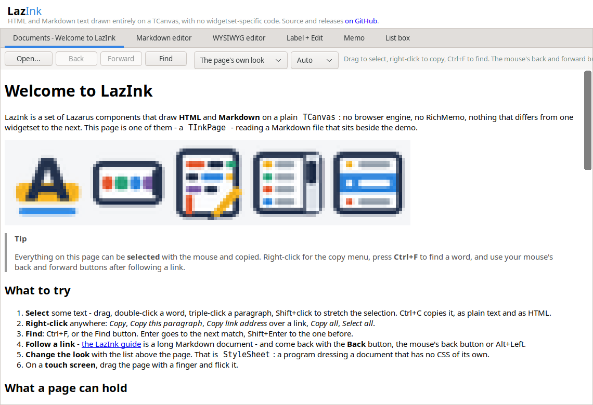
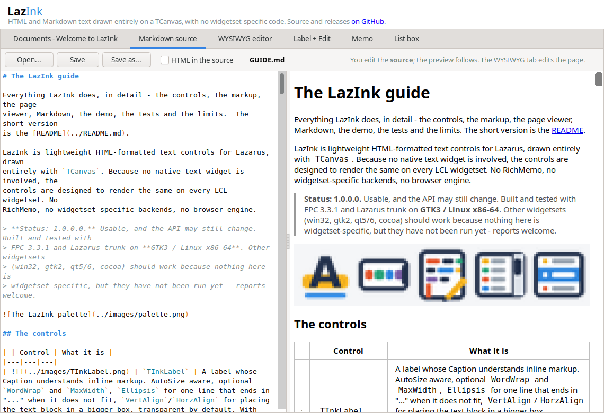
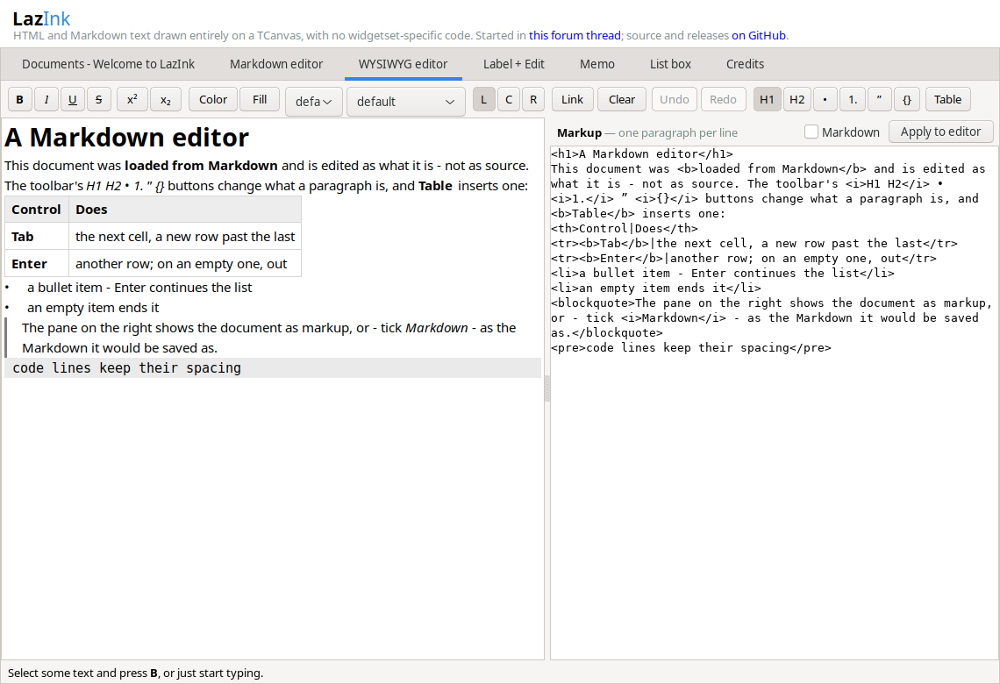
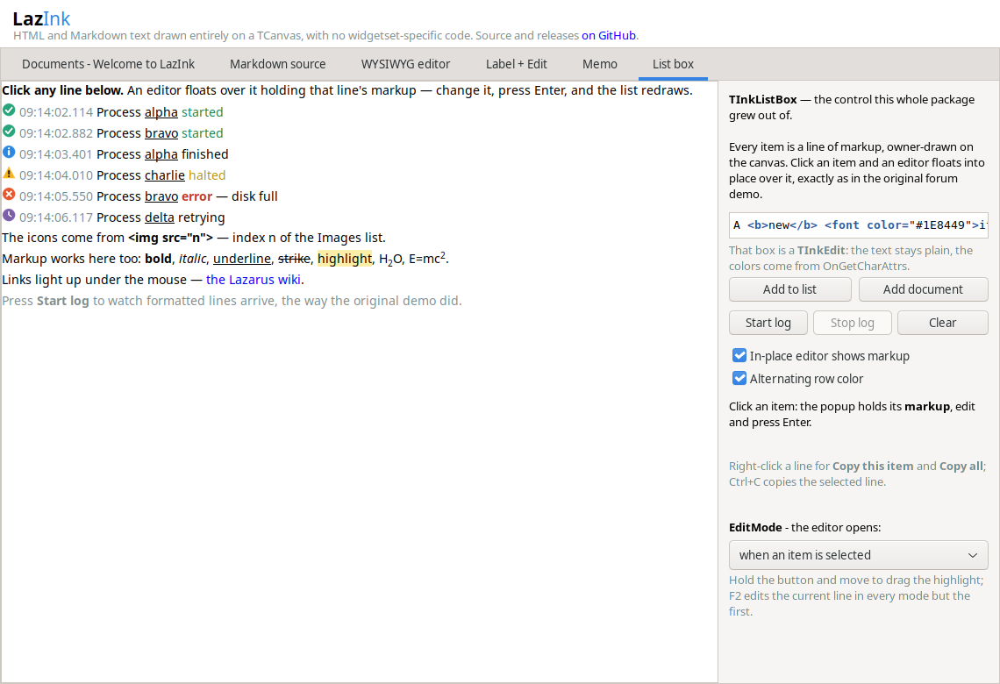

# The LazInk guide

Everything LazInk does, in detail - the controls, the markup, the page
viewer, Markdown, the demo, the tests and the limits.  The short version
is the [README](../README.md).

LazInk is lightweight HTML-formatted text controls for Lazarus, drawn
entirely with `TCanvas`. Because no native text widget is involved, the
controls are designed to render the same on every LCL widgetset. No
RichMemo, no widgetset-specific backends, no browser engine.

> **Status: 1.0.0.0.** Usable, and the API may still change. Built and tested with
> FPC 3.3.1 and Lazarus trunk on **GTK3 / Linux x86-64**. Other widgetsets
> (win32, gtk2, qt5/6, cocoa) should work because nothing here is
> widgetset-specific, but they have not been run yet - reports welcome.


## The controls

| | Control | What it is |
|---|---|---|
|  | `TInkLabel` | A label whose Caption understands inline markup. AutoSize aware, optional `WordWrap` and `MaxWidth`, `Ellipsis` for one line that ends in "..." when it does not fit, `VertAlign`/`HorzAlign` for placing the text block in a bigger box, transparent by default. Its text selects like a page's: a drag takes characters, a double click a word, a triple click everything. |
|  | `TInkEdit` | A single-line edit box where **every character can have its own color and style**, supplied by the `OnGetCharAttrs` event. The text stays plain — great for password-strength coloring, highlighting digits/symbols, or syntax-coloring markup as it is typed. Full editing: caret, selection, clipboard, MaxLength, ReadOnly, alignment, `TextHint` for the empty box, undo/redo (Ctrl+Z, one step per typed word), its own right-click menu, and `PasswordChar` for a secret (drawn as bullets, never copied). |
|  | `TInkRichEdit` | A **multi-line WYSIWYG editor**. The caret and the selection sit inside the rendered text: select a word, call `ToggleStyle(fsBold)`, and that run stops being plain. Per-character color, background, size, face, style, super/subscript and links; paragraph kinds - headings, bullet and numbered lists (nested: Tab and Shift+Tab change the depth), quotes, code lines with their fence language, **tables** (`ApplyParaKind`, `InsertTable`; Tab hops cells, Enter adds a row); **Markdown in and out** (`LoadMarkdown`, `AsMarkdown`); word wrap; paragraph alignment; undo/redo; a `Markup` property that round-trips to the markup below. |
| | `TInkCodeMemo` | A **plain multi-line editor** — the notes field on a form. `Text` and `Lines`, `TextHint`, `MaxLength`, `WantReturns`/`WantTabs`, word wrap, undo, the right-click menu, pasting that brings in plain text only, and `AutoHeight` between `MinLines` and `MaxLines` - a question box that starts as one line and opens up as it is written. Its one decoration is yours: `OnGetCharAttrs` colors every character as it is drawn — how the demo will color Markdown source, without the control knowing any language. |
|  | `TInkMemo` | A scrollable multi-line **viewer** — a log, a transcript, formatted help. Each line of `Lines` is one paragraph of markup, lines can differ in height, optional `WordWrap`; `Append` follows the end when the view is there. For a chat, `AppendBlock` makes a whole message - paragraphs, lists, tables, highlighted code - one entry with its own band color and indent, `ReplaceLast` grows the last entry in place for an answer arriving a word at a time, `AppendPlain` shows a stranger's text exactly as written, and `EntryAt` says which message is under the mouse. Drawn by the same engine as `TInkPage`, so its text is selected and copied the same way. |
| | `TInkPage` | A scrolling **document viewer** for complete HTML or Markdown pages: headings, lists, tables, code and key labels, PNG, animated GIF and WebP images, relative links, anchors, Back and Forward, text selection, find in page, touch scrolling, and a small stylesheet reader. See [Complete help pages](#complete-help-pages). |
|  | `TInkListBox` | An HTML-rendering listbox with an in-place editor that floats over the clicked item, holding either its plain text or (with `EditRawHTML`) its markup. Optional `AlternateColor` striping. A drag inside one item selects its characters for copying. |

**Editing list items in place:** `TInkListBox.EditMode` says when the
floating editor opens by itself - `emOnSelect` (the default; it opens when
the button is released, so the highlight can first be dragged along the list),
`emOnDblClick`, `emOnTripleClick`, `emOnClickSelected` (a click on the item
already selected, after a moment, the way a file manager renames), or
`emNone`. Whatever the mode, `EditItem(Index)` opens it from code, F2 opens it
on the current item (except with `emNone`), `OnBeforeEdit` can refuse, and
`OnItemEdited` sees the result. `EditRawHTML` decides whether the editor holds
the item's markup or its plain text; `Editing` and `CancelEdit` do what they
say.

### Which one?

Two questions decide it: **who writes the text**, and **what shape it is**.

| You want to show... | Who writes it | Use |
|---|---|---|
| a caption, a status, one formatted sentence | the program | `TInkLabel` |
| one line the user types, colored as they type | the user | `TInkEdit` |
| a plain multi-line note the user writes - no formatting wanted | the user | `TInkCodeMemo` |
| a growing stream of separate lines - a log, a chat, a history of events | the program, a line at a time | `TInkMemo` |
| a whole document - a help page, release notes, a README - with headings, lists, code, pictures and links to other pages | an author, ahead of time | `TInkPage` |
| a list of things to pick from, and maybe rename in place | the program, and the user edits single items | `TInkListBox` |
| formatted text the user writes, with a caret and bold/italic/color buttons | the user | `TInkRichEdit` |

The ones that are easy to mix up:

* **`TInkMemo` or `TInkPage`?** Both are scrolling, read-only and selectable,
  and share one engine. A memo is made of **lines you add** with `Append` -
  each line is small inline markup, lines never merge into lists or tables,
  there is no stylesheet, and the view follows new lines as they arrive. A
  page is **one document you load** - it is laid out as a whole, with
  headings, nested lists, code blocks, CSS and navigation between pages.
  If you would call `Append`, it is a memo; if you would call
  `LoadFromFile`, it is a page.
* **`TInkMemo` or `TInkRichEdit`?** The memo is what the **program** says;
  the user can read, select and copy it but not change it. The rich editor is
  what the **user** writes: a caret, typing, formatting buttons, undo, and
  markup coming out of `Markup` at the end.
* **`TInkMemo` or `TInkListBox`?** In a list box a line is a **thing**: it is
  selected as a whole, it has an index, it can be edited in place, and the
  program reacts to which one is chosen. In a memo a line is **text**: you
  select words across lines and copy them, and nothing happens when you click
  one, apart from its links.

`TInkLabel`, `TInkMemo` and `TInkListBox` also share: an `Images` list for
``, `Borders` and `LineSpacing`, a `LinkStyle` / `LinkHoverStyle`
pair so links light up under the mouse, `AutoOpenLink`, and the full set of link
events — `OnLinkClick`, `OnLinkEnter`, `OnLinkLeave`, `OnLinkRightClick`.

## Supported markup

```
<b> <i> <u> <s>                        bold / italic / underline / strikeout
<font color= bgcolor= size= face=>     #RRGGBB, clRed-style and named colors
<font pad="2 8" radius="9" pillborder=>  a pill: a rounded box behind the words
<sup> <sub>                            superscript / subscript
<br> <hr>                              line break / horizontal rule
<p>...</p>                             paragraph: a break plus a blank line
<center> <right> <left>                whole-line alignment
<ind="20">                             indent
<a href="...">text</a>                 links (OnLinkClick, hover styling)
                          entry n of the control's Images list,
                                       at that list's own size
&amp; &lt; &gt; &quot; &nbsp; &copy; &reg; &trade; &euro;
```

Wherever text wraps — `TInkLabel.WordWrap`, `TInkMemo.WordWrap`,
`TInkRichEdit` — lines break on spaces, after slashes in long paths, and,
because CJK does not separate words with spaces, after any Chinese, Japanese or
Korean character, keeping closing punctuation off the start of a line.

Example:

```pascal
InkLabel1.Caption := 'Status: <b><font color="#00AA00">connected</font></b> to <a href="cfg">server</a>';
InkMemo1.Append('<font color="clGray">12:04</font> <b>tony</b> joined');
```

`TInkEdit` doesn't parse markup — it asks you per character instead:

```pascal
procedure TForm1.InkEdit1GetCharAttrs(Sender: TObject; AIndex: Integer;
  const AChar: string; var AColor: TColor; var AStyle: TFontStyles);
begin
  case AChar[1] of
    '0'..'9': AColor := clGreen;
    'A'..'Z', 'a'..'z': ; // leave default
  else
    AColor := clBlue;   // symbols
  end;
end;
```

`TInkRichEdit` is the other way round again — it owns a document, and markup is
only what it reads from and writes back to:

```pascal
InkRichEdit1.Markup.Text := 'A <b>bold</b> start.';   // one paragraph per line
InkRichEdit1.ToggleStyle(fsBold);                     // acts on the selection
InkRichEdit1.ApplyColor(clRed);
InkRichEdit1.ApplySize(18);
ShowMessage(InkRichEdit1.AsHTML('<br>'));             // feed a TInkLabel or TInkMemo
```

With nothing selected, the `Apply*` calls set what the next typed character will
wear, the way every editor behaves. `SelStyle`, `SelColor`, `SelSize`,
`SelFace`, `SelScript` and `SelAlignment` report what the selection currently
carries, so a toolbar can show the right buttons pressed.

## Complete help pages

`TInkPage` is the native scrolling page viewer for complete HTML help files.
It renders the Heckers Sketch manual with headings, lists, tables, code/key
labels, screenshots, animated GIFs and WebP, relative links, and
Back/Forward.  Its small stylesheet reader picks up the site's palette and
typography; CSS grid and flex containers lay out as rows of cards, as many
to a row as fit, and stack them when the page says to below a width.  No
browser engine is added.

```pascal
InkPage1.LoadFromFile('/path/to/help/index.html');
```

**Writing pages for it:** [HTML_SUPPORT.md](HTML_SUPPORT.md) lists
every tag and CSS property it reads, with examples - tables with `colspan`
and `rowspan`, cells with their own fonts and `white-space: nowrap`, tables
nested in cells and in cards, status pills on a `<span>`, pictures sized in
pixels or percentages, WebP, folding sections, `line-height`,
`text-transform`.  Sizes are pixels, the way a browser reads them.  And
`SetInnerHTML('status', '<b>sent</b>')` changes one element by its `id`
without rebuilding the page, for a live status page.

**The page as a tree:** every page - HTML, Markdown or plain text - is
parsed into `Document`, a `TInkDocument` built the way a browser builds
one (unit `InkDOM`): implied `<html>`, `<head>`, `<body>` and `<tbody>`,
paragraphs and list items closed by what follows them, misnested tags
mended, text a table had no room for moved in front of it, the full table
of named characters, and an old page's code page (Windows-1252 and the
others a `<meta charset>` names) read as UTF-8.  A program can read it and
change it, then call `DocumentChanged`:

```pascal
var N: TInkNode;
...
N := InkPage1.Document.GetElementById('status');
N.TextContent := 'Sent';
N.SetAttribute('class', 'ok');
InkPage1.DocumentChanged;   // shown, scroll kept, N still valid
```

`GetElementsByTagName`, `InnerHTML`, `OuterHTML`, `AppendChild`,
`InsertBefore`, `Remove` and `Clone` are there too.  The parser needs no
widgetset, so `InkParseHTML` works in a console program as well.  It never
runs script: `<noscript>` is ordinary content.

It reads Markdown just as well - a `.md` file is recognized by its name, and
`LoadMarkdown` takes a string. Relative images and links are resolved against
the document. A Markdown document has no stylesheet of its own, so
`StyleSheet` lets the program dress it in its own theme; the page's own rules,
when it has some, win over these:

```pascal
InkPage1.StyleSheet.Text :=
  'body { background: #23262c; color: #b8bcc4 } h2 { color: #4ab3e8 }';
InkPage1.LoadMarkdown(ReleaseNotes);
```

Lists hang their bullets and numbers to the left of the text, so wrapped lines
line up under the first word; nested lists step in, and a task list shows its
boxes where the bullets would be. Code blocks keep their spacing in the fixed
face, on a shaded background, and a long line is cut off at the block's edge
rather than wrapped. Quotes get a bar down their left side.

**Its scrollbar** is drawn by LazInk (`TInkScrollBar`), so it can wear the
page's colors instead of the platform's gray.  It reads the same CSS a
browser does:

```css
html { scrollbar-color: #4ab3e8 #1b1e24; scrollbar-width: thin; }
```

`scrollbar-color` is the thumb, then the track - `#rgb`, `#rrggbb`, a color
name, `rgb()`/`rgba()`, `currentcolor`, or a `var()` holding any of those.
`scrollbar-width` is `auto`, `thin` or `none` (none hides the bar; the page
still scrolls).  Both are read from `html` or `:root`, then `body`.  Without
them, the track is the page background and the thumb sits halfway between
that and the text color, so a dark page gets a dark bar with no CSS at all.
`InkPage1.ScrollBar` reaches it from code, and the published `ScrollBars`
property (`issAuto`, `issNone`) turns the bar off from the Object Inspector,
whatever the stylesheet asks for - for a `TInkMemo` a couple of lines high
that wants no bar at all.

**Touch screens:** drag the page with a finger (or the left mouse button) to
scroll it; a quick flick leaves it coasting (`FlickScroll`).  A tap that
wobbles a few pixels is still a click, and a drag that ends on a link does not
follow it.  `DragScroll := False` turns dragging off.  `ScrollY` reads where
the page is.

Most platforms hand a finger to a program as mouse events, and there nothing
more is needed. GTK3 does not: the Lazarus GTK3 backend asks for raw touch
events and ignores them, and GDK then stops turning fingers into mouse events.
The `InkTouch` unit hooks those touch events on each control's own window -
`TInkPage` follows the finger itself, and `TInkEdit`, `TInkRichEdit` and the
page's scrollbar take a finger as the left mouse button - so a program does
nothing, and any number of controls on any number of forms can be touched.
`InkHookTouch` and `InkHookTouchAsMouse` are there for your own controls, and
`TInkPage.Touch` takes touches from a source of your own.  Only the first
finger is followed. `TInkLabel` has no window of its own, so on GTK3 a finger
does not reach it. The GTK3 path is tested with GDK touch events made by the
test suite; it has not yet been run on a touch screen.

**Selecting and copying:** the mouse selects text on a page the way it does in
a browser - drag, double-click for a word, triple-click for a paragraph,
Shift+click to extend, dragging past the top or bottom scrolls - across
paragraphs, list items, code and table cells. Ctrl+C copies it as plain text
and as HTML; Ctrl+A selects everything. A finger still scrolls
(`MouseDrag := imdScroll` makes the mouse scroll too, for platforms that
cannot tell a finger from a mouse). The highlight is `SelectionColor`, or a
page's `::selection { background: ... }`. From code: `SelectAll`, `Select`,
`SelectedText`, `SelectedHTML`, `CopyToClipboard`, and the character-level
hit test `PositionAt(X, Y)` with its reverse `PositionPoint`.

**Pictures you can click:** a picture inside a link is the link -
`<a href="shots/x.gif" target="_blank"></a>`. Clicking
it (or any link) fires `OnLinkActivate` first, with a `TInkLinkInfo`: the URL
resolved and as written, the link's `target`, and the picture it wraps; set
`Handled` to deal with it yourself - open a zoom window, say. `ClickedLink`
has the same while `OnLinkClick` runs. Left alone, a link to a picture opens
it as a page of its own, with Back to return. For a window that shows one
picture, `ImageFit := iifWindow` makes it as large as fits (`iifWidth`: as
wide as the page; `iifShrink`, the default: never larger than it is):

```pascal
procedure TForm1.PageLinkActivate(Sender: TObject; const Link: TInkLinkInfo;
  var Handled: Boolean);
begin
  if Link.Image = '' then Exit;           // text links: let the page follow them
  ZoomForm.Page.ImageFit := iifWindow;
  ZoomForm.Page.LoadFromURL(Link.Image);
  ZoomForm.Show;
  Handled := True;
end;
```

Pages given as text (`LoadHTML`, `LoadMarkdown`) are in the Back/Forward
history too; `ClearHistory` forgets it.

**Finding:** Ctrl+F opens a find bar at the top right of the page - it finds
as you type, Enter or F3 goes to the next match and Shift with either to the
one before, Esc closes it. From code: `Find(Text, Options)`, `FindCount`,
`ShowFindBar`, `ScrollIntoView`.

**Back and Forward:** `Back`, `Forward`, `CanGoBack` and `CanGoForward` are
there for buttons, and `OnNavigate` fires after each new document so the
buttons can follow. The mouse's own back and forward buttons work too - on
GTK3, where the Lazarus backend drops them, `InkTouch` brings them back - and
so do Alt+Left, Alt+Right and a keyboard's Back and Forward keys.

**The copy menu:** right-click any display control for **Copy**, **Copy this
paragraph** (or line, or item), **Copy link address** over a link, **Copy
all** and **Select all**. `TInkMemo` selects and copies like the page, and
on both, Shift with the arrows, Home, End, PgUp and PgDn extends the
selection from the keyboard. `TInkLabel` selects with the mouse - a drag,
a word on a double click, everything on a triple - and so does
`TInkListBox` inside one item: a drag that stays in the pressed item's row
selects its characters (leaving the row drags the highlight, as always),
and Ctrl+C copies the characters when some are selected, the selected
lines otherwise, and everything after Ctrl+A. A mouse selection also lands
on X11's primary clipboard, ready for a middle click. `CopyMenu := False`
turns the menu off, a `PopupMenu` of your own replaces it, and
`OnCopyMenu` lets you add items as it opens:

```pascal
procedure TForm1.PageCopyMenu(Sender: TObject; Menu: TPopupMenu; X, Y: Integer);
var Item: TMenuItem;
begin
  Item := TMenuItem.Create(Menu);
  Item.Caption := 'Search the web';
  Item.OnClick := @SearchSelection;
  Menu.Items.Add(Item);
end;
```

Try the demo's **Documents** tab, or pass an HTML filename on its command
line. Keep the help folder's relative image and stylesheet paths intact.
Remote content can be supplied through `OnResource`; HTTP transport is not
built in. See [the compatibility report](HELP_COMPATIBILITY.md) for the
exact CSS subset, tested site coverage, and remaining limitations.

## Tables and Markdown

`TInkLabel`, `TInkMemo`, `TInkListBox`, and `TInkPage` expose `TextFormat`:
`itfHTML` (the default), `itfMarkdown`, or `itfPlain` - text shown exactly
as written, no tags, entities or Markdown read, so a ticket or a log like
`width < 24" & square` needs no escaping anywhere.  All declared in
`InkMarkdown`.  Changing it reinterprets the existing source; it does not
translate the source.
`TInkEdit` remains plain text.  `TInkRichEdit` edits paragraphs with kinds -
headings, bullet and numbered lists, quotes, code lines and **table rows** -
and reads and writes Markdown itself: `LoadMarkdown` brings a document in
(nested lists flatten to one level), `AsMarkdown` writes it back with
`**bold**`, `*italic*`, `~~strike~~`, code spans, links, fenced code and
pipe tables with their head and delimiter rows.  A table row's cells are
the text between literal `|` characters, which draw as the grid rather
than as glyphs; consecutive rows share their column widths, the head row
is bold on a band, **Tab** hops to the next cell (a new row past the last
one), **Enter** adds a row, and Enter on an empty row ends the table -
as Enter at a heading's end starts a plain paragraph and an empty list
item ends its list.  `InsertTable(Cols, Rows)` starts one from nothing.

The shared renderer supports `<table>`, `<tr>`, `<th>` and `<td>` blocks,
including multiple tables mixed with text, `colspan` and `rowspan`, and a
table nested inside a cell. Columns are sized from their content and narrowed
to the available width, cell text wraps (or doesn't: `white-space: nowrap`
keeps a column as wide as its words), headers are bold, and cells can carry
their own padding, backgrounds, borders, rounded corners, fonts and sizes -
on a page, all of it written from CSS. Links inside cells retain click and
hover support. List boxes measure variable-height rows, with `ItemHeight`
as their minimum height.

Markdown is read the way GitHub reads it, for the parts real documents use:
`#` and underlined headings (with GitHub's anchors, so `[see](#some-heading)`
works), paragraphs joined across wrapped lines, hard breaks, bullet and
numbered lists nested by indentation (wrapped continuation lines included),
task lists `- [x]`, fenced code with its language kept
(`class="language-pascal"`), indented code, blockquotes and `> [!NOTE]`
alerts, horizontal rules, pipe tables with their alignment, `*` `_` `**` `__`
and `~~` emphasis, code spans, inline, reference and `<angle>` links, bare
`https://` and `www.` links, images, entities and backslash escapes. HTML
comments are dropped. Other raw HTML is shown as text unless you ask for it
(`MarkdownToHTML(S, [imoRawHTML])`, or `TInkPage.MarkdownRawHTML`) - only do
that for documents you trust.  The middle ground is `imoInlineHTML`
(`TInkPage.MarkdownInlineHTML`): well-formed inline tags named on
`InkMarkdownInlineTags` - `<kbd>`, `<sub>`, `<br>` and the rest LazInk
draws - pass through keeping only `class` and `title`, while a
`/tiles <folder>` placeholder, a block tag or a script stays visible text.

`MarkdownToHTML` gives real HTML - headings, paragraphs, lists, `<pre>` - and
is what `TInkPage` draws. `MarkdownToInk` flattens the same HTML into the
inline markup `TInkLabel`, `TInkMemo` and `TInkListBox` draw, so every control
reads the same Markdown.

```pascal
uses InkMarkdown;

InkMemo1.TextFormat := itfMarkdown;
InkMemo1.WordWrap := True;
InkMemo1.LoadDocument(
  '# Status' + LineEnding +
  '| Name | State |' + LineEnding +
  '| --- | --- |' + LineEnding +
  '| **Server** | Ready |');
```

Memo `Lines` and list-box `Items` remain independent entries. Use
`TInkMemo.LoadDocument` to replace its contents with one complete multiline
HTML or Markdown entry; splitting a table across entries cannot work. For labels,
assign the complete source to `Caption`. `MarkdownToInk(Source)` is also usable
on its own. `SaveAsHTML` on the viewers converts Markdown entries to HTML;
plain-text export removes formatting and separates table cells and rows.

Limits: the inline controls have no stylesheet of their own - a table in a
memo or list box takes its look from attributes in the markup, which is what
`TInkPage` writes from a page's CSS.  No `<col>`/`<colgroup>` widths and no
table editing tools.  Very long unbroken words can overflow a cell, and very
narrow controls may not fit the minimum cell padding.  Use `TInkPage` for a
full document with headings, lists and code blocks.

The demo's **Markdown editor** tab shows a live preview of what you type.
Renderer tests run on Linux x86-64 with a display available:

```sh
LAZARUS_DIR=/path/to/lazarus FPC=/path/to/fpc tests/run.sh
```

The test script defaults to GTK3; set `LCL_WIDGETSET` for another built widgetset.
This change has been built and tested with FPC 3.3.1 and Lazarus trunk on GTK3.

## The demo

`demo/lazinkdemo.lpi` - a tour of the package, a tab for each control.
Everything is built at design time, so you can open `demo/main.lfm` in the form
designer and push it around; nothing is conjured up at run time.

**Documents** opens on `demo/tour.md`, a Markdown page about LazInk shown by a
`TInkPage`: select text, right-click to copy, Ctrl+F to find, follow the link
to this README and come back with the mouse's back button. The list above the
page switches its look through `StyleSheet`, and the scheme box beside it
answers the page's `@media (prefers-color-scheme)` queries through
`ColorScheme`.



**Markdown editor** is the source and its live preview side by side, and opens
this guide when the demo starts. It opens and saves files; the other tabs
only show what the controls can do.  The source pane is a `TInkCodeMemo`
colored by the demo itself through `OnGetCharAttrs` - headings, markers,
code spans, quotes and table pipes each in their own color, LazInk's own
machinery and no SynEdit anywhere.



**WYSIWYG editor** opens on a document **loaded from Markdown** and edited
as the thing itself - a heading, a table (Tab hops cells, Enter adds rows),
lists, a quote and code, with toolbar buttons for what a paragraph is.  The
right pane shows the document as markup, or - tick *Markdown* - as the
Markdown it would be saved as, and **Apply** reads either back:



**Label + Edit**, **Memo** and **List box** show the smaller controls - the
list box is the demo this whole package grew out of, a simulated log arriving
into an owner-drawn list with an editor that floats into place over the item
you click:



`lazinkdemo FILE` opens a page on the Documents tab, and
`lazinkdemo --screenshots DIR` saves a picture of every tab and quits - which is
how the pictures here are made.

## Installing

Open `lazink.lpk` with **Package → Open Package File (.lpk)**, then
**Compile → Use → Install** and rebuild the IDE when prompted. The components
appear on the **LazInk** palette tab. For lazbuild-only workflows:

```
lazbuild --add-package-link /path/to/lazink.lpk
```

then add `LazInk` to your project's required packages. The demo already requires
`LazInk`: open `demo/lazinkdemo.lpi`, or run `lazbuild demo/lazinkdemo.lpi`
from the repository root after registering the package link. Keep `demo/tour.md`,
`demo/code.md`, this guide, and its relative images/docs alongside the demo.

Dependencies are the Lazarus-supplied `LCL`, `LazUtils`, and `FCL` packages.
See [OPM.md](../OPM.md) for release and submission notes.

## Limits

LazInk renders a **subset** of HTML, on purpose. It is not a web browser:

* No JavaScript, forms, video or web fonts.
* Pictures: PNG, JPEG and the rest of what FPC decodes, animated GIF, and
  **WebP** - still and animated, lossy and lossless, with alpha - decoded in
  Pascal, with no library to install.
* CSS is a small reader, not CSS conformance - no positioning, no
  pseudo-classes and no `#id` selectors; descendant selectors only inside
  tables and flex/grid containers; flex and grid lay out as rows of cards,
  not the full specification; `@media` understands only `min-width`,
  `max-width` and `prefers-color-scheme` (answered by the control's
  `ColorScheme` property - auto follows the program's say or the control's
  own background).  A `style` attribute is read for color, background, size,
  weight, slant, decoration and alignment, on a word or on a whole block.
  No floats, and no text flowing around a picture.
* Tables take widths, columns, spacing, padding, cell colors, borders and
  rounded corners from CSS, and read `colspan`, `rowspan` and a table inside
  a cell.  They have no `<col>`/`<colgroup>` widths.
* The Markdown is GitHub's, as documents use it, not CommonMark-complete:
  emphasis follows simpler rules than the specification, a link reference
  definition has to fit on one line, and footnotes are not read.
* LazInk colors code blocks a little - comments, strings, numbers and
  keywords.  Comment and quote rules cover about sixty language names;
  keyword lists exist for the dozen or so that turn up in documents, Pascal
  first among them.  A block that names no language is colored by the rules
  most languages share.  It is not a real highlighter and will not always be
  right; `HighlightCode` turns it off, and `OnHighlightCode` lets a program
  color the block itself (with SynEdit, say).  `demo/code.md` has a block of
  each.
* Every code block has a **header**, as code viewers draw one: the
  language and how many lines on the left, **Copy** on the right (it copies
  the code alone and says "Copied" for a moment).  `CodeFoldLines` folds a
  longer block to its first lines with **Show all N lines** / **Show less**;
  `CodeActions` adds the program's own buttons ("Use this", "Run") and
  `OnCodeAction` says which was pressed, on which block, with the code and
  its language.  `CodeHeader := False` takes the header away.  On
  `TInkPage` and `TInkMemo` alike; `CodeButtons` and `FoldCode` do the same
  from code.
* No built-in HTTP downloads - a host supplies remote content through
  `OnResource`.

**[HTML_SUPPORT.md](HTML_SUPPORT.md) is the reference for writing
pages** - every tag and every CSS property LazInk reads, with examples.
[docs/HELP_COMPATIBILITY.md](HELP_COMPATIBILITY.md) is the audit of one
real help site against it.

## Tests

```sh
LAZARUS_DIR=/path/to/lazarus FPC=/path/to/fpc tests/run.sh
```

runs the document-tree checks (`tests/dom_tests.pas`, no widgetset needed),
then the renderer and Markdown checks.  The parser is also measured against
the html5lib tree-construction tests, which are not in this repository:

```sh
git clone https://github.com/html5lib/html5lib-tests
git -C html5lib-tests checkout 224991e^ -- tree-construction
fpc -Fu. -Fu$LAZARUS_DIR/components/lazutils/lib/x86_64-linux tests/html5lib_check.pas
tests/html5lib_check html5lib-tests/tree-construction      # add 20 to see failures
```

1706 of their 1784 cases build the same tree (9 October 2026); most of the
rest are the 2025 `<select>` rules and stray NUL bytes.  Given a file listing HTML pages and an
output folder, it also loads and renders every page at several widths and
checks every image decodes:

```sh
LAZARUS_DIR=... FPC=... tests/run.sh pages.txt results/
```

Given those two, it also checks that every visible piece of text in the source
pages survived into the rendered page (`tests/check_help_text.pas`, which reads
the pages with the FCL's own HTML reader rather than LazInk's).

To put a page up beside a real browser's rendering of it, in one command:

```sh
LAZARUS_DIR=... FPC=... tools/compare.sh          # the long page, in Xephyr
LAZARUS_DIR=... FPC=... tools/compare.sh my.html  # one of your own
```

It writes the page if it is the generated one, takes the browser's picture
when there isn't a current one, builds the viewer and opens the two side by
side with their scrolling locked together.  `tests/compare/long.html` is
ninety-six numbered sections cycling through every construct LazInk draws -
about thirty thousand pixels of it - so a section that looks wrong can be
named rather than described.

A page keeps its blocks' finished geometry, so painting, measuring and hit
testing share one layout rather than each rebuilding it.
`tests/layout_cache_checks.pas` renders the same markup with and without that
cache and compares painted pixels and the run callbacks, not merely that a
render happened.  To measure rather than check:

```sh
LAZARUS_DIR=... FPC=... tools/run_render_bench.sh table 250
```

[RENDER_PERFORMANCE_AUDIT.md](RENDER_PERFORMANCE_AUDIT.md) has the
numbers, what they came from, and what is still worth doing.

To find *where* a page disagrees with a browser rather than looking for it:

```sh
LAZARUS_DIR=... FPC=... tools/drift.sh tests/compare/long.html
```

It asks a browser where every heading of the page landed - with a script
injected into a copy of it, so the numbers are the browser's own layout and
not something read off a picture - asks LazInk the same, and prints the two
beside each other with the drift at each heading and how much each section
grew between them.  The long page is currently within thirteen pixels of the
browser over thirty-six thousand.

## Where it is going

[ROADMAP.md](../ROADMAP.md) is the plan - only what is still open: runs
on the other widgetsets and on real touch hardware, an Online Package
Manager listing, a small CSS round (zebra striping, text-overflow and
friends), images floated beside text, scrolling speed on very long pages,
and polish on the WYSIWYG Markdown editor - which reads, edits and writes
Markdown whole, headings to tables, something nothing else for Lazarus
does.  How everything already finished was built, and why, is
[HISTORY.md](HISTORY.md).

## License

**0BSD** — the BSD Zero Clause License. See [LICENSE](../LICENSE) and
[LICENSES/0BSD.txt](../LICENSES/0BSD.txt). Lazarus/LCL and Free Pascal dependencies
retain their own licenses.
